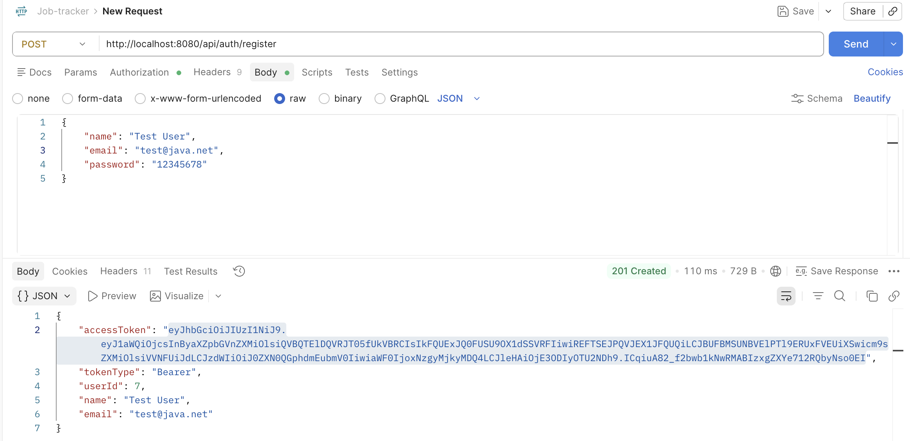
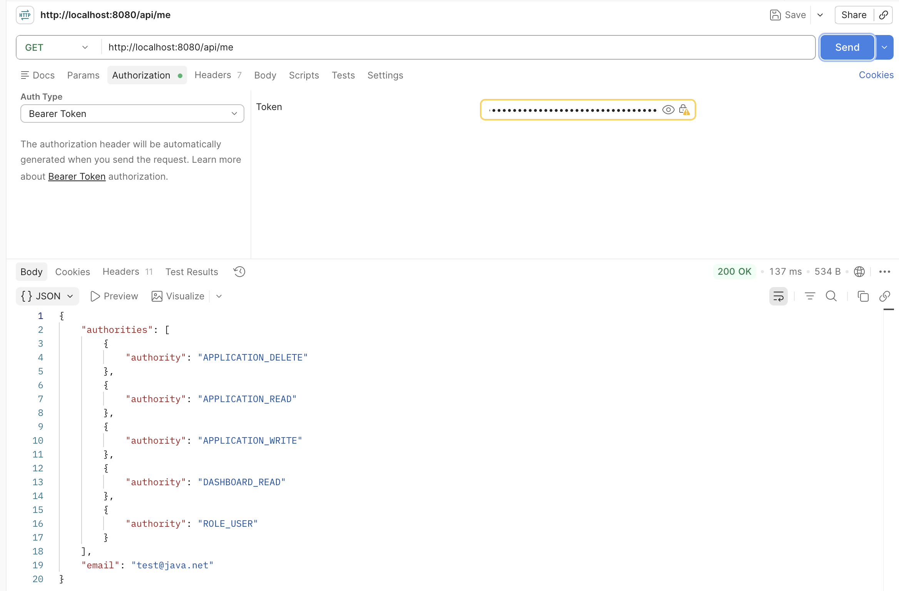
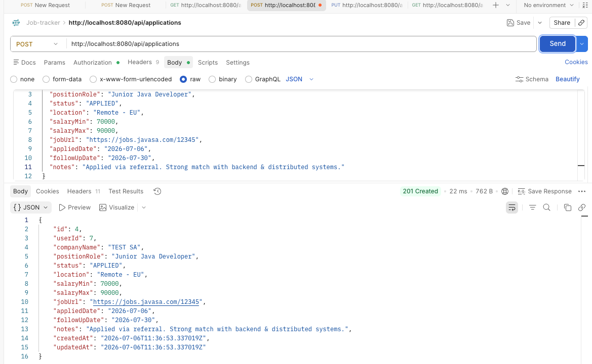
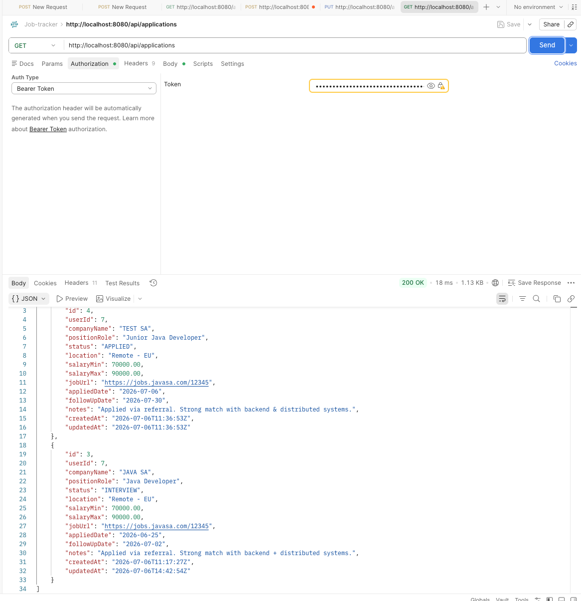
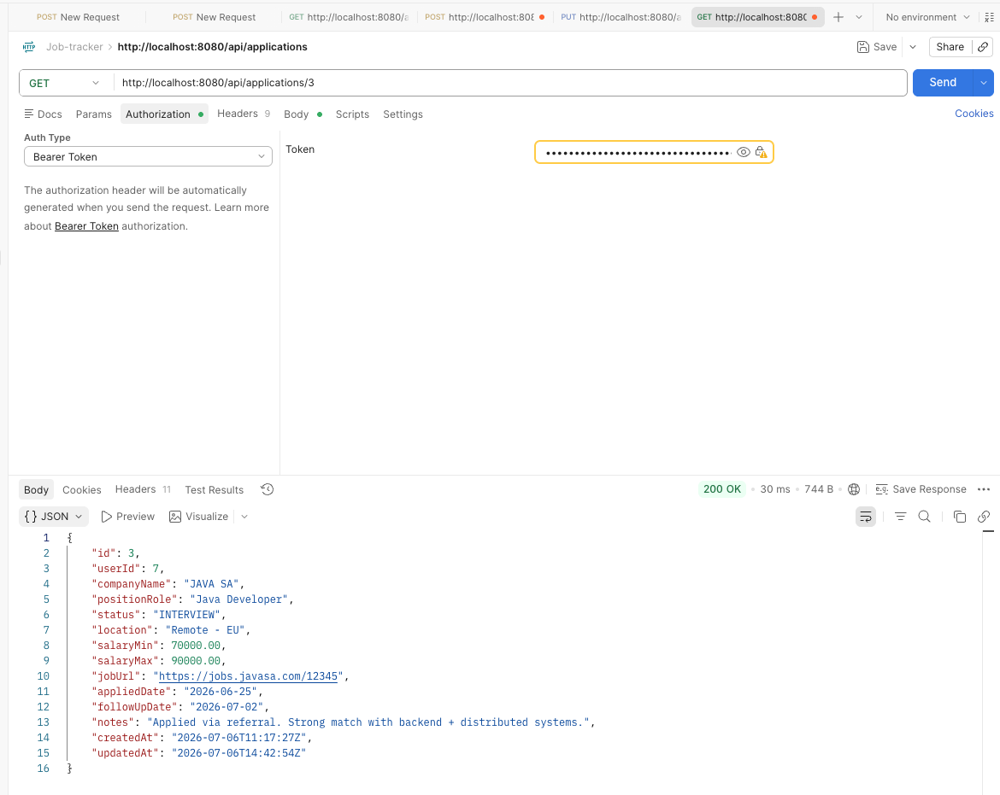
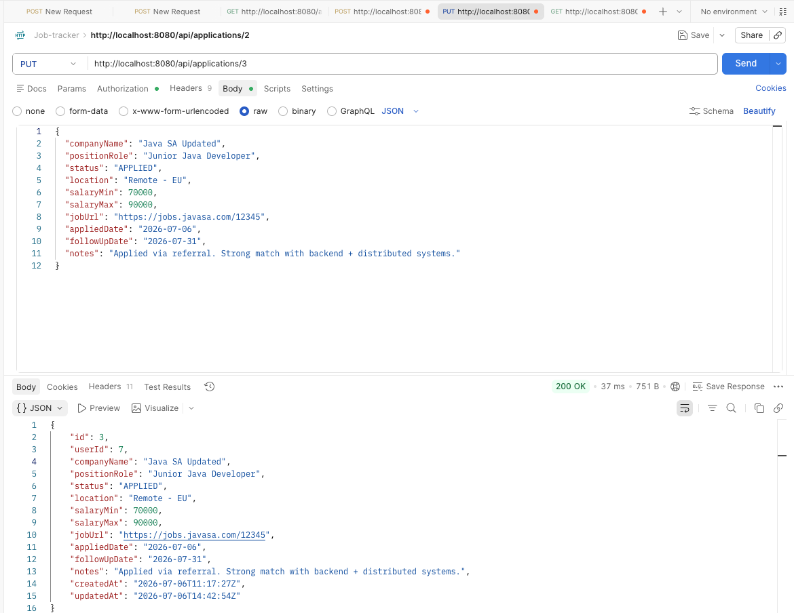
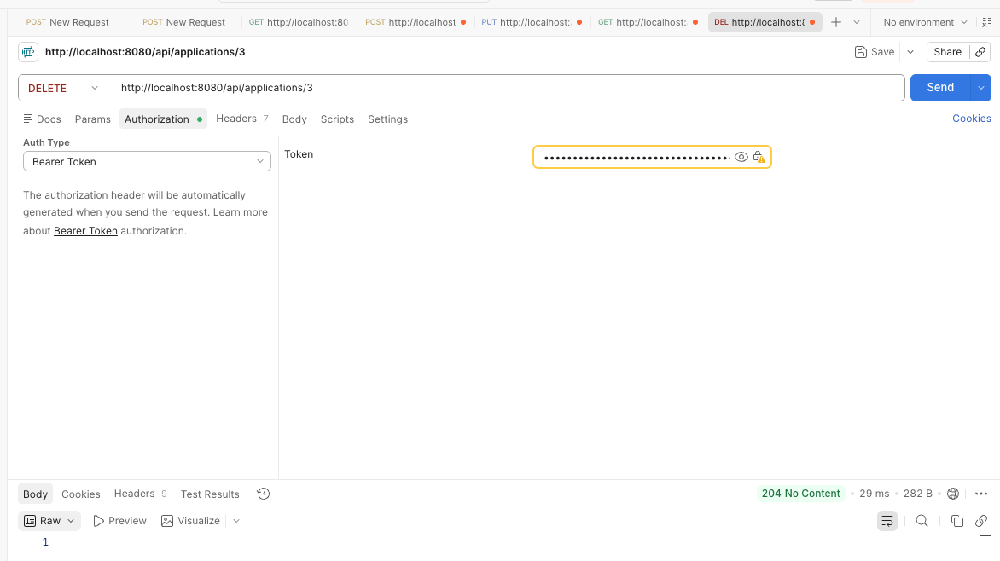

# Job Tracker API (Spring Boot)

A REST API for tracking job applications with JWT authentication and dynamic RBAC (roles + privileges).

## Tech Stack
- Java 21
- Spring Boot 3.5.x
- Spring Security 6
- Spring Data JPA (Hibernate)
- Flyway (DB migrations)
- MySQL
- JWT (jwt)

## Features Implemented
- Database schema via Flyway migration (`V1__init_rbac_schema.sql`)
- RBAC tables:
    - `users`
    - `roles`
    - `privileges`
    - `user_roles`
    - `role_privileges`
    - `job_applications`
- Auth:
    - `POST /api/auth/register`
    - `POST /api/auth/login`
    - `POST /api/auth/refresh`
- JWT-based stateless security
- Protected test endpoint:
    - `GET /api/me`
- Method security enabled (`@EnableMethodSecurity`)
- Optimized auth loading with `@EntityGraph` for roles/privileges

## Project Structure (high level)
- `auth/` → authentication logic and DTOs
- `security/` (or `filter/`) → JWT service + JWT filter + user details service
- `config/` → Spring Security config
- `user/` → entities (`User`, `Role`, `Privilege`)
- `repository/` → JPA repositories
- `resources/db/migration/` → Flyway SQL migrations

## Configuration

Create your own local config file.

`src/main/resources/application.yml` (example):
```yaml
jwt:
  secret: ${JWT_SECRET}
  expiration-ms: 3600000

spring:
  profiles:
    active: ${ACTIVE_PROFILE:dev}
  datasource:
    url: ${DB_URL}
    username: ${DB_USERNAME}
    password: ${DB_PASSWORD}

  jpa:
    hibernate:
      ddl-auto: validate
    show-sql: true
    properties:
      hibernate:
        format_sql: true
    open-in-view: false

  flyway:
    enabled: true
    locations: classpath:db/migration
    baseline-on-migrate: true

  application:
    name: job-tracker

logging:
  level:
    org.flywaydb: DEBUG
```

### Environment variables
- `JWT_SECRET` (Base64, at least 32-byte key)
- `DB_USERNAME`
- `DB_PASSWORD`
- `DB_URL` (e.g., `jdbc:mysql://localhost:3306/job_tracker_db`)
- `ACTIVE_PROFILE` (e.g., `dev`)

Generate JWT secret:
```bash
openssl rand -base64 32
```

## Run Locally

1. Start MySQL
2. Create env vars
3. Run:

```bash
./mvnw clean spring-boot:run
```

Flyway will run migrations automatically.

## API Test
Base URL: `http://localhost:8080`

---

### Auth
#### Register
- **POST** `/api/auth/register`
- **Description:** Creates a new user with default `USER` role.


- **Success response:** `201 Created`

#### Login
- **POST** `/api/auth/login`
- **Description:** Authenticates user and returns JWT.


- **Success response:** `200 OK`

### Refresh endpoint
- **POST** `/api/auth/refresh`
- **Description:** Refreshes the access token using a valid refresh token.

Request body:
```json
{
  "refreshToken": "..."
}
```

Response:
```json
{
  "accessToken": "...",
  "refreshToken": "...",
  "tokenType": "Bearer"
}
```

> Important: do **not** send refresh token in `Authorization` header for this flow. Send it in JSON body.

---

### User
#### Me (protected)
- **GET** `/api/me`
- **Auth:** `Bearer <accessToken>`
- **Description:** Returns authenticated principal info.


- **Success response:** `200 OK`

---

### Job Applications

> All endpoints below require:  
> `Authorization: Bearer <accessToken>`

#### Create application
- **POST** `/api/applications`
- **Authority required:** `APPLICATION_WRITE`


- **Success response:** `201 Created`

---

#### List my applications
- **GET** `/api/applications`
- **Authority required:** `APPLICATION_READ`


- **Success response:** `200 OK` (array)

---

#### Get one application
- **GET** `/api/applications/{id}`
- **Authority required:** `APPLICATION_READ`


- **Success response:** `200 OK`

---

#### Update application
- **PUT** `/api/applications/{id}`
- **Authority required:** `APPLICATION_WRITE`


- **Success response:** `200 OK`

---

#### Delete application
- **DELETE** `/api/applications/{id}`
- **Authority required:** `APPLICATION_DELETE`


- **Success response:** `204 No Content`

---

## Error Response Format

The API uses a global exception handler and returns consistent error JSON:

```json
{
  "timestamp": "2026-06-25T09:20:30Z",
  "status": 400,
  "code": "VALIDATION_ERROR",
  "message": "Validation failed",
  "path": "/api/auth/register",
  "details": {
    "email": "must be a well-formed email address"
  }
}
```

Common status codes:
- `400` Bad Request (validation/business errors)
- `401` Unauthorized (invalid credentials / missing token)
- `403` Forbidden (missing authority)
- `500` Internal Server Error

---

## Postman Testing Flow

1. Call `POST /api/auth/register`
2. Call `POST /api/auth/login` and copy `accessToken`
3. In Postman, set header:
  - `Authorization: Bearer <accessToken>`
4. Test:
  - `GET /api/me`
  - `POST /api/applications`
  - `GET /api/applications`
  - `PUT /api/applications/{id}`
  - `DELETE /api/applications/{id}`

---

## Frontend Integration (Angular)

The backend is consumed by an Angular frontend running on:

- `http://localhost:4200`

### CORS
CORS is enabled in Spring Security via `CorsConfigurationSource` and allows:

- Origin: `http://localhost:4200`
- Methods: `GET, POST, PUT, DELETE, PATCH, OPTIONS`
- Headers: `*`
- Credentials: `true`

### Authentication Flow (JWT)

1. `POST /api/auth/register` (optional)
2. `POST /api/auth/login` → returns `accessToken`
3. Frontend sends header on protected endpoints:

```http
Authorization: Bearer <accessToken>
```

4. Frontend can validate auth state using:
  - `GET /api/me`

### Authorization Rules (Job Applications)

Job application endpoints require JWT and authorities:

- `GET /api/applications` → `APPLICATION_READ`
- `GET /api/applications/{id}` → `APPLICATION_READ`
- `POST /api/applications` → `APPLICATION_WRITE`
- `PUT /api/applications/{id}` → `APPLICATION_WRITE`
- `DELETE /api/applications/{id}` → `APPLICATION_DELETE`

> Note: Applications are user-scoped. A logged-in user only sees their own records.

### Local Run

Backend:
```bash
./mvnw spring-boot:run
```

Frontend:
```bash
cd job-tracker-ui
ng serve
```